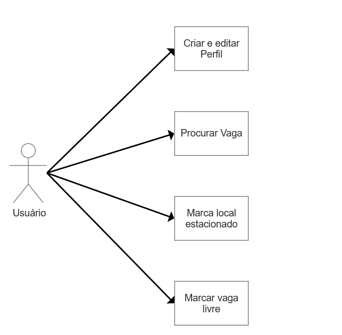
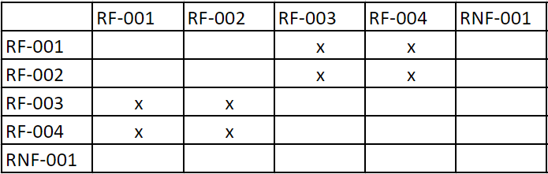
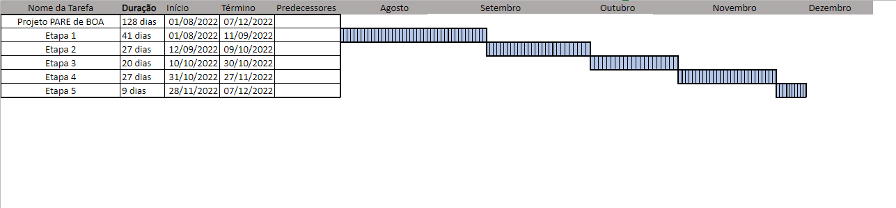
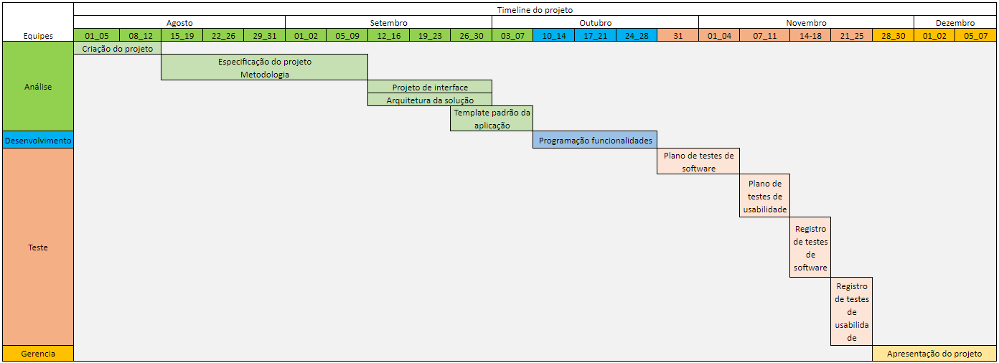
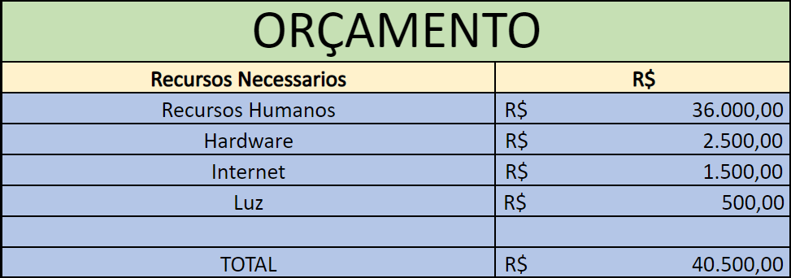

# Especificações do Projeto

A definição exata do problema e os pontos mais relevantes a serem tratados neste projeto foi consolidada com a participação dos usuários em um trabalho de imersão feita pelos membros da equipe a partir da observação dos usuários em seu local natural e por meio de entrevistas. Os detalhes levantados nesse processo foram consolidados na forma de personas e histórias de usuários.  

## Personas

As personas levantadas durante o processo de entendimento do problema são apresentadas na Figuras que se seguem. 

|  | **Erika Moraes**                                          |                                                              |
| ------------------------------------------------------------ | ------------------------------------------------------------ | ------------------------------------------------------------ |
| **Idade**: 28 anos. **Ocupação**: Analista de marketing tem uma vida bastante corrida, trabalha em tempo integral e está focada no seu crescimento profissional. | **Aplicativos:** Instagram, Facebook, WhatsApp, LinkedIn, waze.    |                                                              |
| **Motivações**: Trabalha longe de casa, usa seu carro por o transporte publico e muito lotado. | **Frustrações**: Demora procurando vaga proximo ao trabalho chegando atrasada algumas vezes. Perder muito tempo para estacionar o carro ao ir passear no final de semana. | **Hobbies, História**: Ir a praia na folga e passear no shopping. |

|  | **Diva Tereza Suares**                                          |                                                              |
| ------------------------------------------------------------ | ------------------------------------------------------------ | ------------------------------------------------------------ |
| **Idade**: 58 anos. **Descrição:** Aposentada, viúva, tem uma vida tranquila financeiramente. Tem problemas de saúde que a impede de fazer exercício físico. É uma pessoa antenada e sabe utilizar internet e redes sociais. | **Aplicativos**: Google, Facebook, WhatsApp, Google Maps.                 |                                                              |
| **Motivações**: Passear com as amigas. visitar o filho no final de semana | **Frustrações**: Demorar para achar vaga ao fazer suas consultas medicas. | **Hobbies, História**: É uma pessoa que admira e coleciona orquídeas. Gosta de postar fotos de suas orquídeas nas redes sociais. Ama fazer refeições com as amigas. |

|  | **Angela Santos**                                         |                                                              |
| ------------------------------------------------------------ | ------------------------------------------------------------ | ------------------------------------------------------------ |
| **Idade**: 37 anos. **Descrição**: Trabalha como cabelereira, casada, possui 2 filhos. É uma mulher muito dedicada a família. | **Aplicativos**: Google, Facebook WhatsApp, Instagram, google maps.       |                                                              |
| **Motivações**: Acha que é muito importante ter um tempo para para passear com os filhos. Levar e buscar os filhos na escola.  | **Frustrações**: Perder tempo em tarefas desnecessarias, pois após o trabalho quer se dedicar a familia | **Hobbies, História**: Gosta de passear com os filhos no parque aos fins de semana. |

|  | **Armando Salgado Filho**                                             |                                                              |
| ------------------------------------------------------------ | ------------------------------------------------------------ | ------------------------------------------------------------ |
| **Idade**: 25 anos. **Descrição**: solteiro, Veterinário especialista em animais de pequeno porte, trabalha em uma clínica veterinária. Faz parte de uma ONG que acolhe animais em situação de rua. | **Aplicativos**: Google, Facebook, WhatsApp, Telegram, Instagram. |                                                              |
| **Motivações**: Gostaria de ter um modo de estacionar o carro proximo onde possa levar seu cachorro para brincar. | **Frustrações**: Dificuldade de locomoção com seu cachorro o obrigando sempre a usar seu carro. | **Hobbies, História**: Gosta de ir ao parque com seus animais. |

|  | **Rafael Menezes**                                           |                                                              |
| ------------------------------------------------------------ | ------------------------------------------------------------ | ------------------------------------------------------------ |
| **Idade**: 39 anos. **Descrição**: Consultor de moda, mora junto com o namorado há mais de 10 anos. | **Aplicativos**: Google, Facebook, WhatsApp, Instagram.          |                                                              |
| **Motivações**: Sair para passear com o namorado.  | **Frustrações**: Acha muito demorado localizar vagas proximo a praia nos finais de semana. | **Hobbies, História**:  Adora caminhar ao ar livre nos fins de semana. Adora ir a praia com seu namorado. |

|  | **Manuela Ferrari de Souza**                                        |                                   |
| ------------------------------------------------------------ | --------------------------------------------------------- | --------------------------------- |
| **Idade**: 23 anos. **Descrição**: Trabalha no mercado financeiro, acabou de se mudar para casa do namorado. | **Aplicativos**: Google, LinkedIn, WhatsApp, Instagram.   |                                   |
| **Motivações**: Apartamento so possui uma vaga no predio e cada um tem seu proprio carro.  | **Frustrações**: dificuldade de localizar uma vaga proxima a sua casa. | **Hobbies, História**:  Ler livros. |

## Histórias de Usuários

Com base na análise das personas forma identificadas as seguintes histórias de usuários:

|EU COMO... `PERSONA`| QUERO/PRECISO ... `FUNCIONALIDADE` |PARA ... `MOTIVO/VALOR`                            |
|--------------------|------------------------------------|---------------------------------------------------|
|Erika               | Usar o carro para ir ao trabalho   | Transporte publico demorado e lotado              |
|Erika               | Achar um meio de localizar vagas   | Perde muito tempo para localizar vaga             |
|Diva                | Visitar o filho que mora longe     | Dificuldade de achar vaga proximo ao filho        |
|Angela              | Levar os filhos para se divertir   | Ter mais tempo com os filhos                      |
|Armando             | Levar o cachorro para brincar      | Não poder levar o animal em qualquer transporte   |
|Rafael              | Ir a praia no final de semana      | Perde muito tempo para localizar vaga             |
|Manuela             | Vaga proximo a sua casa            | Só tem uma vaga no predio e o namorado usa        |

## Modelagem do Processo de Negócio 

### Análise da Situação Atual

Apresente aqui os problemas existentes que viabilizam sua proposta. Apresente o modelo do sistema como ele funciona hoje. Caso sua proposta seja inovadora e não existam processos claramente definidos, apresente como as tarefas que o seu sistema pretende implementar são executadas atualmente, mesmo que não se utilize tecnologia computacional. 

### Descrição Geral da Proposta

Apresente aqui uma descrição da sua proposta abordando seus limites e suas ligações com as estratégias e objetivos do negócio. Apresente aqui as oportunidades de melhorias.

### Processo 1 

### Processo 2 – NOME DO PROCESSO

Apresente aqui o nome e as oportunidades de melhorias para o processo 2. Em seguida, apresente o modelo do processo 2, descrito no padrão BPMN.

## Indicadores de Desempenho

| Indicador | Objetivos | Descrição | Cálculos | Fonte dados | Perspectiva |
|-----------|-----------|-----------|----------|-------------|-------------|
| Cadastros Realizados| Analisar o crescimento de usuarios cadastrados | Total de cadastros na platamorma | Mensal | Cadastro usuários plataforma | Demanda de dados |
| Vagas cadastradas | Almentar a dispnibilidade do serviço | Total de cadastro de vagas | Mensal | Cadastro de vagas plataforma | Melhorar serviço |
| Vagas ocupadas | Analisar o uso da plataforma | total de vagas utulizadas | diario | Contator de vagas | Saber usuários utilizando a aplicação |

## Requisitos

As tabelas que se seguem apresentam os requisitos funcionais e não funcionais que detalham o escopo do projeto. Para determinar a prioridade de requisitos, aplicar uma técnica de priorização de requisitos e detalhar como a técnica foi aplicada.

### Requisitos Funcionais

|ID    | Descrição do Requisito                                                   | Prioridade |
|------|--------------------------------------------------------------------------|------------|
|RF-001| A aplicação deve permitir que o usuário crie um perfil                   |   ALTA     | 
|RF-001| A aplicação deve permitir que o usuário edite o perfil                   |   MÉDIA    |
|RF-002| A aplicação deve permitir ao usuário pesquisar vagas                     |   ALTA     |
|RF-003| A aplicação deve permitir que o usuário informe local onde estacionou    |   ALTA     |
|RF-003| A aplicação deve permitir que o usuário informe vaga livre               |   ALTA     |
|RF-004| A aplicação deve permitir que o usuário adicione novo local com vaga     |   MÉDIA    |

### Requisitos não Funcionais

|ID     | Descrição do Requisito                                                                        |Prioridade |
|-------|-----------------------------------------------------------------------------------------------|-----------|
|RNF-001| A aplicação deverá ser responsiva permitindo a visualização em um celular de forma adequada   |   ALTA    | 
 

## Restrições

O projeto está restrito pelos itens apresentados na tabela a seguir.

|ID| Restrição                                                                       |
|--|---------------------------------------------------------------------------------|
|01| O projeto deverá ser entregue até o final do semestre                           |
|02| As decisões pertinentes ao projeto devem ser tomadas por todos os participantes |

Enumere as restrições à sua solução. Lembre-se de que as restrições geralmente limitam a solução candidata.

> **Links Úteis**:
> - [O que são Requisitos Funcionais e Requisitos Não Funcionais?](https://codificar.com.br/requisitos-funcionais-nao-funcionais/)
> - [O que são requisitos funcionais e requisitos não funcionais?](https://analisederequisitos.com.br/requisitos-funcionais-e-requisitos-nao-funcionais-o-que-sao/)

## Diagrama de Casos de Uso

 

# Matriz de Rastreabilidade

# Gerenciamento de Projeto

De acordo com o PMBoK v6 as dez áreas que constituem os pilares para gerenciar projetos, e que caracterizam a multidisciplinaridade envolvida, são: Integração, Escopo, Cronograma (Tempo), Custos, Qualidade, Recursos, Comunicações, Riscos, Aquisições, Partes Interessadas. Para desenvolver projetos um profissional deve se preocupar em gerenciar todas essas dez áreas. Elas se complementam e se relacionam, de tal forma que não se deve apenas examinar uma área de forma estanque. É preciso considerar, por exemplo, que as áreas de Escopo, Cronograma e Custos estão muito relacionadas. Assim, se eu amplio o escopo de um projeto eu posso afetar seu cronograma e seus custos.

## Gerenciamento de Tempo

Com diagramas bem organizados que permitem gerenciar o tempo nos projetos, o gerente de projetos agenda e coordena tarefas dentro de um projeto para estimar o tempo necessário de conclusão.

## Gerenciamento de Equipe

## Gestão de Orçamento

