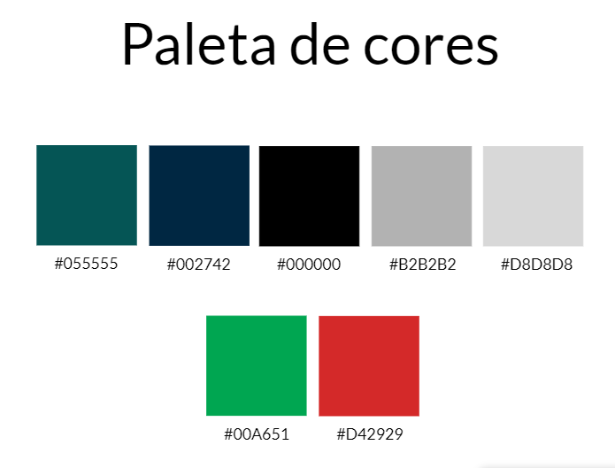
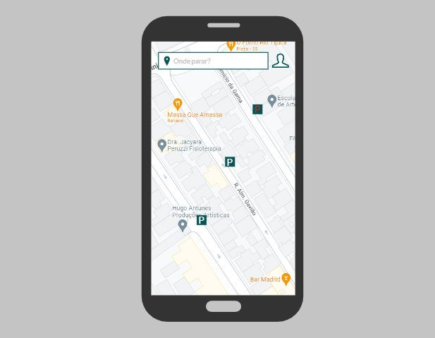
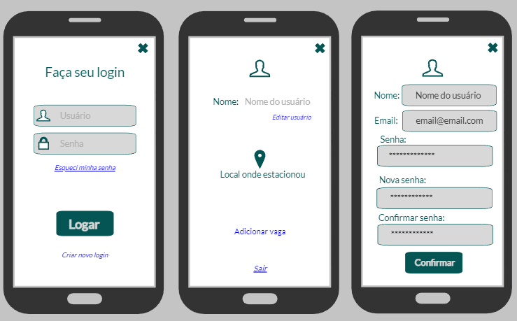
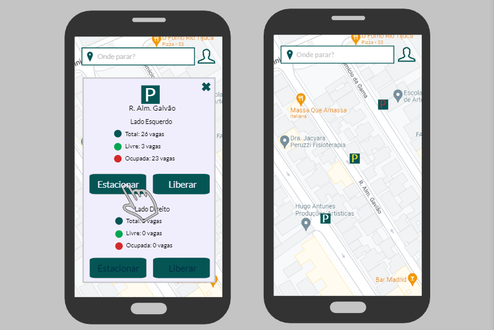

# Template Padrão da Aplicação

Pré-requisitos: <a href="2-Especificação do Projeto.md"> Especificação do Projeto</a>, <a href="3-Projeto de Interface.md"> Projeto de Interface</a>, <a href="4-Metodologia.md"> Metodologia</a>

Layout padrão da aplicação que será utilizado em todas as páginas com a definição de identidade visual, aspectos de responsividade e iconografia.

# Paleta de cores

## Aplicação nas telas e fluxos

### Tela - Inicial

Na tela inicial vc tera a visão do mapa e das ruas com vaga cadastrada e disponiveis

### Tela - Login e Usuário

Ao tocar no usuario poderá, logar, ver seu perfil e editar perfil

### Tela - Vagas

Ao tocar em uma rua, voçê conseguirá ver a quantidade de vagas e colocar se estacionou ou sair da vaga

